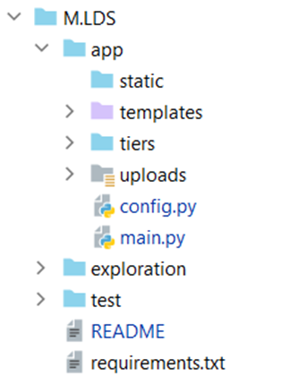

Ce module est la déclinaison du projet fil rouge pour le cours langages en data-sciences
Le code est sous https://github.com/Parreirac/arxiv_m1/tree/master/M0.LDS.
# Sujet/Goal 
Write a Flask application that provides an API that reads an uploaded pdf,extract its metadata & text them available for consumption by the user.

Use a Python package to handle PDF processing (probably PDFMiner)
Use a git repository for sources
Use a requirements.txt file to specify dependencies and their versions

Possible API:
* POST   /documents          upload a new pdf, responds a document ID
* GET       /documents/<id>       describe document processing state (pending, success, failure), metadata and links to contents
* GET       /text/<id>.txt        a way to read the extracted text

Possibly use a (redis celery) queue to analyze the document asynchronously
Check warnings with Pylint/flake8, reformat the code with black & isort
Check code coverage with pytest-cov

# Orientation du développement
Ce projet constitue l’ossature du projet fil rouge (dans la pratique c’est le module 0). 
Je n’utiliserai pas de base de données (elle est déjà dans le module 1, voir https://github.com/Parreirac/arxiv_m1/tree/master/M1.Extract, une deuxième base de données pourrait être également être introduite dans les autres modules).
Il n’y aura probablement pas de gestion de droit dans le projet fil rouge car on ne s’enregistre pas dans les sites tels que https://arxiv.org/.
Je n’ai pas utilisé swagger qui m’aurait pris trop de temps (j’ai trouvé les problèmes de compatibilité des packages particulièrement décourageants). J’ai codé moi-même la documentation de l’API dans une route (/doc). Cela demeure sommaire mais c’est dynamique et fonctionne sans grande compétence en html/css/js (ou en flask).
J’ai tenté d’utiliser celery, mais j’ai trouvé cela très lourd par rapport aux besoins de ce module. On pourrait imaginer de tester le module sur gros fichier pdf, mais la plus-value est plus sur un traitement complexe que sur l’affichage brut du texte, qui pose souvent problème par construction du pdf (à contrario des fichier tex). En revanche en partant de https://blog.miguelgrinberg.com/post/using-celery-with-flask, j’ai produit https://github.com/Parreirac/arxiv_m1/blob/master/M.LDS/exploration/MainLongTask.py qui permet un emploi proche (permet de simuler des tâches longues, voir la figure qui suit) dans un thread, sans utiliser ni celery ni redis.

 

Cela pourrait servir dans les autres modules.
/!\ Après utilisation de semanticscholar, cette modification aurait été utile. Mais je ne l’ai pas implémenté faute de temps.
Si la requête vers semanticscholar est trop lente relancer le requête sur https://api.semanticscholar.org/"
(Il s’agit plus de montrer ce que l’on peut faire dans le cadre du projet fil rouge.)

Remarque : pas de classe actuellement. (Plus utile dans les autres modules). Et un seul try/except pour gérer le RequestEntityTooLarge.

Actuellement l’application permet d’uploader graphiquement 1 à 3 fichiers pdf.
(La drop zone est issue de https://blog.miguelgrinberg.com/post/handling-file-uploads-with-flask.)

Organisation du projet
Le projet est organisé comme indiqué dans la figure qui suit.

 

* App :
  * Static pour des fichiers à partager avec les clients web
  * Template : des patrons pour des pages html à transmettre aux clients
  * Tiers : le code non-lié à flask 
  * Config.py pour le paramétrage de l’application 
  * Main.py le code flask avec le point d’entrée de l’application. 
  * Upload : le fichier qui va contenir les fichiers uploader par les utilisateurs (dans des sous-répertoires séparés). 
* Exploration : des tests que j’ai pu réaliser, sur différents package python typiquement. 
* Test : le répertoire de test de l’application avec deux fichiers pdf.

# Installation

A ce stade, l’application s’utilise comme les applications flask vues en cours. A terme, un déploiement automatisé doit être réalisé (Docker, terraform …).

(Désolé, faute de temps j'ai actuellement un mélange français/anglais dans l'IHM, ce qui est peu élégant.)

L’application est configurée via le fichier config.py. 
Le serveur stocke les fichiers dans un répertoire paramétrable :
UPLOAD_FOLDER: str = './uploads/'.
Le serveur vérifie que l’extension est bien autorisée. Actuellement :
ALLOWED_EXTENSIONS = {'tex', 'pdf'}.

## Manuelle
python -m venv venv
venv/bin/activate
pip install -r requirements.txt
export FLASK_APP= main
export FLASK_ENV=development

Ce lance avec python main.py
Ouvrez http://localhost:5000 dans un navigateur pour essayer le logiciel ou utilisez l'API via un 
curl -F ‘data=@path/to/local/file’ UPLOAD_ADDRESSlocalhost:5000/upload

## Utilisation de l’IDE 
PyCharm fait tout, tout seul. (C'est gratuit pour les étudiants...)

Ouvrez http://localhost:5000 dans un navigateur pour essayer le logiciel ou utilisez l'API via un 
curl -F ‘data=@path/to/local/file’ UPLOAD_ADDRESSlocalhost:5000/upload

## Utilisation avec docker 
Créer l'image
docker build . -t m0
Lancer l'application :
docker run -d --name mycontainer -p5000:5000 m0
Vous pouvez maintenant accéder à l'application depuis un navigateur avec l'url http://127.0.0.1:5000/
Une documentation de l'API est donnée en utilisant l'url http://127.0.0.1:5000/doc.
# Api
L’API permet une exploitation directe (POSTMAN ou curl), ou via une IHM accessible par un navigateur web. 
La route « /doc » construit dynamiquement la liste des routes du serveur en 
 

*Modification 25/04/23*
Modification du code pour utiliser flasgger. Utilisez maintenant la route /apidocs.

# Qualité du code
## Gestion de version
Le code a été produit avec PyCharm 2022.3.2 (Professional Edition), qui est disponible gratuitement pour les élèves de l’école.
J'ai utilisé mon github, mais avec à cette heure, j'ai un problème de conflit j'update le dépôt.
(Outre le souhait de renommer le projet en module 0.)

Cette difficulté m'a empêché d'utiliser les TAG (comme c'est le cas dans le module 1).

 
## Qualité
Les imports ont été optimisés via l’IHM de l’IDE.
 
Le code a été testé avec pylint en outil externe de PyCharm.
Il demeure :
* les fixme. (Je trouvais malhonnête de seulement les supprimer.) 
* app\tiers\pdf.py:15:11: E1101: Instance of '_VirtualList' has no 'extract_text' mem-ber (no-member), qui est un faux positif
* app\config.py:4:0: R0903: Too few public methods (0/2) (too-few-public-methods)
Mais les notes demeurent élevées.

Faute de temps, je n'ai pas testé le code avec flake8.
J'ai testé visuellement la couverture dans l'IHM.

## Tests unitaires

J'ai également codé quelques tests, dont celui sur un fichier avec un espace dans le nom.
Deux fichiers pdf sont présents dans le repertoire test.

# Evolutions possibles

Outre les évolutions liées au projet fil rouge. On pourrait :
* Afficher mieux les informations dans les onglets. Au moins de la même façon que l'on peut visualiser une reponse JSON.
* Modifier les métadonnées du pdf qui sont souvent fausses. Voire en ajouter (par exemple la bibliographie).
* Extraire les images et les tables
* Comparer les perf de api de lecture d’un pdf
* travailler sur l'axe CSS pour l'ihm, i18n. Difficulté sur javascript bootstrap. 
* tester l'API avec POSTMAN

# Evolution réalisée

## 25/04/23
Modification du code pour utiliser flasgger (https://github.com/flasgger/flasgger). 
Utilisez maintenant la route /apidocs, plus complète.

